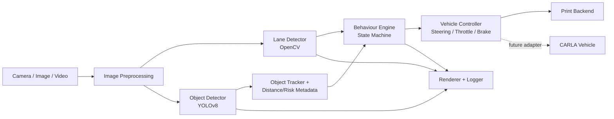

# CARLA-Based Autonomous Driving Simulation Using Machine Learning

An academic, modular autonomous-driving perception and control pipeline designed to run on ordinary images, videos, and webcams today, and connect to the CARLA simulator when its Python API is available.

## Project Overview

The repository demonstrates a production-style perception stage: camera input is preprocessed, lanes are estimated with classical computer vision, road users are detected with YOLOv8, and an explainable rule-based module produces normalized steering, throttle, and brake commands. CARLA is deliberately an integration boundary rather than a simulated implementation.

## Features

- OpenCV lane detection: grayscale, Gaussian blur, Canny edges, ROI, Hough lines, averaged lane boundaries, center/offset/angle metrics.
- Reusable Ultralytics YOLOv8 detector for cars, buses, trucks, motorcycles, people, traffic lights, and traffic signs, with lightweight IoU/centroid tracking.
- Structured object metadata: persistent ID, class, confidence, bounding box, monocular distance approximation, relative position, and LOW/MEDIUM/HIGH collision risk.
- Deterministic modular driving-behaviour state machine: Cruise, Lane Centering, Follow Vehicle, Slow Down, Emergency Brake, and Recovery.
- Backend-neutral vehicle controller with a safe print backend and a real CARLA adapter boundary.
- YAML configuration, typed dataclasses, structured logs, video/webcam/image input, and optional rendered outputs.
- Google Colab and VS Code friendly layout with lightweight unit tests.

## Architecture



## Technology Stack

Python 3.11+, OpenCV, NumPy, PyTorch, Ultralytics YOLOv8, Matplotlib, PyYAML, pytest, and the optional CARLA Python API.

## Folder Structure

```text
Autonomous-Driving-CARLA/
├── config/              # YAML and typed configuration loader
├── datasets/            # Dataset policy and metadata guidance
├── models/              # Local model-weight guidance
├── assets/              # Samples, generated outputs, architecture asset
├── docs/                # Design, report, and review notes
├── src/                 # Perception, decision, control, logging, CLI
├── tests/               # Fast unit tests
└── notebooks/           # Optional experiments
```

## Installation

```bash
git clone <your-repository-url>
cd Autonomous-Driving-CARLA
python -m venv .venv
# Windows: .venv\Scripts\activate
# Linux/macOS: source .venv/bin/activate
pip install -r requirements.txt
```

CARLA is optional for the current perception-stage workflow. Install the CARLA Python package according to the version of the CARLA server you use before selecting `CarlaBackend`.

## Usage

Edit `config/settings.yaml`, then run an image, video, or webcam source:

```bash
python -m src.main --config config/settings.yaml
pytest -q
```

Set `input.source` to a path such as `assets/sample_images/drive.jpg`, a video path, or a camera index such as `0`. Set `input.display: false` for headless environments such as Colab. The first YOLOv8 run may download `yolov8n.pt` into the configured model path.

Object distance is a configurable monocular approximation based on bounding-box height and assumed real-world object height. It is not true depth estimation; calibrated stereo, LiDAR, or sensor fusion should be used for safety-critical distance measurement.

The behaviour engine consumes lane confidence/offset and tracked object metadata. Its transition thresholds and speed targets are exposed under `control` in `config/settings.yaml`; every decision overlay includes the current state.

For Colab, clone the repository, install `requirements.txt`, upload a media file, and change `input.source` in the YAML or pass a copied configuration path.

## Screenshots

Add project screenshots to `assets/sample_images/` and link them here once a CARLA or recorded-camera run is available:


## Future Scope

- Connect `CarlaBackend` to an actual CARLA actor and sensor bridge.
- Add temporal lane tracking, camera calibration, depth, and sensor fusion.
- Train and evaluate a project-specific YOLO model with documented datasets.
- Replace rules with a learned planning policy after safety baselines are measured.
- Add experiment tracking, scenario replay, metrics dashboards, and CI.

## Contributors

Add student names, roles, institution, and supervisor here.

## License

Released under the MIT License. See [LICENSE](LICENSE).
